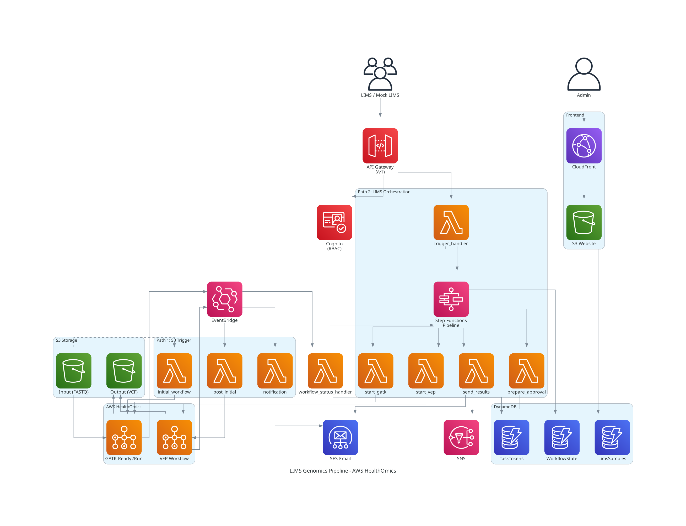

# AWS HealthOmics + LIMS Integration Pipeline

An automated genomics analysis pipeline that integrates a Laboratory Information Management System (LIMS) with [AWS HealthOmics](https://aws.amazon.com/healthomics/) using event-driven architecture. The system runs GATK (Germline Short Variant Discovery) and VEP (Variant Effect Predictor) workflows, with admin approval, multi-tenant data isolation, and email delivery of results.



## Features

- **Two pipeline paths**: EventBridge-triggered (S3 upload) and LIMS Orchestration (API + Step Functions with admin approval)
- **Role-based access control (RBAC)**: Cognito User Pool with `admin`, `operator`, and `viewer` groups
- **Multi-tenant data isolation**: Organization-level data separation via JWT claims
- **Admin approval workflow**: Step Functions `waitForTaskToken` pattern with 7-day timeout
- **Email result delivery**: SES-based HTML emails with presigned S3 download URLs
- **Mock LIMS emulator**: Streamlit app for testing without a real LIMS

## Architecture

The system is deployed as 4 CDK stacks:

| Stack | Description |
|-------|-------------|
| `omics-eventbridge-solution` | HealthOmics workflows, S3 buckets, EventBridge rules, VEP container build |
| `lims-cognito-auth` | Cognito User Pool, groups, domain, pre-token-generation Lambda |
| `lims-orchestration` | Step Functions, API Gateway, DynamoDB tables, 14 Lambda functions |
| `lims-frontend` | S3 + CloudFront static dashboard with OAuth2 login |

Key AWS services: HealthOmics, Step Functions, API Gateway, Lambda, DynamoDB, Cognito, EventBridge, S3, CloudFront, SES, SNS, CodeBuild, ECR.

See [ARCHITECTURE.md](./ARCHITECTURE.md) for detailed data flows, DynamoDB schemas, Lambda reference, and troubleshooting.

## Prerequisites

- **AWS CLI** configured with credentials for `us-east-1`
- **Node.js 18+** and **npm** (for CDK CLI)
- **Python 3.12+** (Lambda runtime)
- **Docker** (for VEP container image build)
- **AWS CDK CLI**: `npm install -g aws-cdk`
- An AWS account with HealthOmics access (Ready2Run workflows are only available in `us-east-1`)

Bootstrap CDK in your account (first time only):

```bash
cdk bootstrap aws://<YOUR_ACCOUNT_ID>/us-east-1
```

## Quick Start

```bash
# Clone the repository
git clone https://github.com/hmkim/aws-healthomics-eventbridge-integration.git
cd aws-healthomics-eventbridge-integration

# Create and activate a virtual environment
python3 -m venv .venv
source .venv/bin/activate
pip install -r requirements.txt

# Configure deployment settings
# Edit constants.py — set SES_SENDER_EMAIL, SES_RECIPIENT_EMAIL, ADMIN_EMAIL
vi constants.py

# Synthesize and deploy all stacks
cdk synth
cdk deploy --all --require-approval never
```

### Post-Deployment Steps

1. **Set `FRONTEND_URL`**: After the first deploy, copy the CloudFront URL from the `lims-frontend` stack outputs and set it in `constants.py`:

   ```python
   "FRONTEND_URL": "https://<your-cloudfront-domain>",
   ```

   Then redeploy to apply CORS settings:

   ```bash
   cdk deploy lims-orchestration
   ```

2. **Verify SES email addresses** (required in SES sandbox mode):

   ```bash
   aws ses verify-email-identity --email-address <your-sender-email>
   aws ses verify-email-identity --email-address <your-recipient-email>
   ```

   Check your inbox and confirm both verification emails.

## Creating Test Users and Sample Data

The `seed_test_data.py` script creates Cognito users and DynamoDB sample records for testing.

```bash
# Get the User Pool ID from CDK outputs or AWS Console
python scripts/seed_test_data.py --user-pool-id <your-user-pool-id> --region us-east-1

# Preview without creating anything
python scripts/seed_test_data.py --user-pool-id <your-user-pool-id> --dry-run
```

This creates:

| Organization | Users | Samples |
|-------------|-------|---------|
| **ORG-ACME** (ACME Genomics Lab) | admin@acme.example.com (`admin`), operator@acme.example.com (`operator`), viewer@acme.example.com (`viewer`) | 5 samples (rare disease trio WGS, clinical WES) |
| **ORG-BIOCORP** (BioCorp Research) | admin@biocorp.example.com (`admin`), researcher@biocorp.example.com (`operator`) | 5 samples (immuno-oncology WES, tumor panel) |
| **ORG-UNIVERSITY** (State University Medical Center) | pi@university.example.com (`admin`, `operator`) | 5 samples (pharmacogenomics WES, population WGS) |

**Password reset**: Users are created with random temporary passwords. To set a usable password, go to the Cognito Hosted UI login page and use the **Forgot password** flow. The Hosted UI URL is:

```
https://lims-genomics-<account-id>.auth.us-east-1.amazoncognito.com/forgotPassword?client_id=<your-client-id>&response_type=code&redirect_uri=https://<your-cloudfront-domain>/callback.html
```

## Running Tests

```bash
# Activate the virtual environment
source .venv/bin/activate

# Run all tests (179 tests)
pytest tests/

# Run specific test files
pytest tests/test_validators.py
pytest tests/test_send_results.py -v
pytest tests/test_trigger_handler.py -v
```

Tests mock AWS services using `unittest.mock`. Lambda handlers create boto3 clients at module level, so tests set environment variables before importing:

```python
@mock.patch.dict(os.environ, {"TABLE_NAME": "test", "ALLOWED_ORIGIN": "https://example.com"})
def test_handler(self):
    from lambda_function.my_module import handler
    # ...
```

## Mock LIMS Emulator

A Streamlit application that simulates a LIMS system for end-to-end testing.

```bash
pip install streamlit
cd mock_lims
streamlit run app.py
```

In the sidebar, configure:
- **API Endpoint URL**: `https://<your-api-id>.execute-api.us-east-1.amazonaws.com/v1`
- **S3 Input Bucket**: the input bucket name from CDK outputs
- **User Pool ID** and **App Client ID**: from the `lims-cognito-auth` stack outputs

Log in with a Cognito user, then submit single or batch samples for analysis.

## API Reference

**Base URL**: `https://<your-api-id>.execute-api.us-east-1.amazonaws.com/v1`

All endpoints require a Cognito `id_token` in the `Authorization` header.

| Method | Path | Required Role | Description |
|--------|------|---------------|-------------|
| POST | `/analysis/start` | operator | Start genomics analysis pipeline |
| GET | `/analysis/status/{sample_id}` | viewer | Query pipeline status for a sample |
| POST | `/admin/approve` | admin | Approve or reject analysis results |
| GET | `/admin/pending` | admin | List pending approval requests |
| GET | `/admin/results` | admin | List approved results |
| POST | `/admin/results/send` | admin | Send results via email with presigned URLs |
| GET | `/lims/samples` | viewer | List LIMS samples (filtered by organization) |

### Example: Start Analysis

```bash
curl -X POST "$API_URL/analysis/start" \
  -H "Authorization: $ID_TOKEN" \
  -H "Content-Type: application/json" \
  -d '{
    "source": "ClarityLIMS",
    "event_type": "analysis.requested",
    "data": {
      "sample_id": "SAM-001",
      "project_id": "PROJ-001",
      "patient_id": "PAT-001",
      "submitter_email": "user@example.com",
      "reference_genome": "GRCh38",
      "analysis_type": "WGS",
      "fastq_paths": {
        "r1": "s3://your-input-bucket/reads/sample_R1.fastq.gz",
        "r2": "s3://your-input-bucket/reads/sample_R2.fastq.gz"
      }
    }
  }'
```

### Example: Approve Results

```bash
curl -X POST "$API_URL/admin/approve" \
  -H "Authorization: $ID_TOKEN" \
  -H "Content-Type: application/json" \
  -d '{
    "sample_id": "SAM-001",
    "timestamp": "2026-01-15T08:00:00.000Z",
    "decision": "APPROVED",
    "comment": "Results verified"
  }'
```

## Pipeline Status Lifecycle

```
Normal flow:
  INITIALIZED -> GATK_RUNNING -> GATK_COMPLETED -> VEP_RUNNING -> VEP_COMPLETED
    -> AWAITING_APPROVAL -> COMPLETED_APPROVED or COMPLETED_REJECTED

Error states:
  VALIDATION_FAILED  — Input validation failure
  WORKFLOW_FAILED    — GATK/VEP execution failure
  WORKFLOW_TIMEOUT   — HealthOmics did not complete within 24 hours
  APPROVAL_TIMEOUT   — Admin did not respond within 7 days
```

## Cost Estimation

| Service | Cost |
|---------|------|
| HealthOmics GATK-BP Germline fq2vcf | ~$10 per run |
| HealthOmics VEP (private workflow) | ~$0.17 per run |
| S3 storage (1 GB sample data) | ~$0.023/month |
| Lambda, EventBridge, SNS | Within AWS Free Tier |

**Total per run**: approximately **$10.59** with sample test data.

> **Warning**: Be cautious with batch submissions. Each sample triggers a full GATK + VEP pipeline run.

## Clean Up

```bash
# Empty S3 buckets first (CDK cannot delete non-empty buckets)
aws s3 rm s3://healthomics-cka-input-<account-id>-us-east-1 --recursive
aws s3 rm s3://healthomics-cka-output-<account-id>-us-east-1 --recursive

# Destroy all stacks
cdk destroy --all
```

## Important Notes

- **Region**: Must deploy to `us-east-1` — HealthOmics Ready2Run workflows are only available in this region.
- **HealthOmics TPS limit**: `StartRun` API quota is 1.0 requests/second. All Lambda functions use adaptive retry (`max_attempts=10`).
- **SES sandbox mode**: New AWS accounts start in SES sandbox mode where both sender and recipient emails must be verified. Request production access in the AWS Console for unrestricted sending.
- **GATK Ready2Run Workflow ID**: Currently `9500764`. This ID is managed by AWS and may change. Verify with:
  ```bash
  aws omics list-workflows --type READY2RUN --region us-east-1 \
    --query "items[?name=='GATK-BP Germline fq2vcf for 30x Genome']"
  ```
- **VEP container build**: The first deployment builds a VEP Docker image via CodeBuild (~5-10 minutes).
- **Secrets in code**: Consider using [git-secrets](https://github.com/awslabs/git-secrets) or a pre-commit hook to prevent accidental commits of credentials.

## Security Considerations

- No hardcoded secrets — all sensitive configuration is in `constants.py` (gitignored for local overrides via `constants.local.py`)
- IAM least-privilege policies scoped to specific resource ARNs
- S3 buckets encrypted at rest with `BlockPublicAccess.BLOCK_ALL`
- HTTPS enforced on CloudFront (`REDIRECT_TO_HTTPS`)
- Cognito password policy: 12+ characters, mixed case, numbers, symbols
- MFA support (optional TOTP)
- Presigned URLs expire after 24 hours
- CORS restricted to the CloudFront domain
- Frontend tokens stored in `sessionStorage` (cleared on tab close)
- XSS prevention via `escapeHtml()` utility

## License

[MIT-0 License](./LICENSE)

## Third-Party Licenses

See [THIRD-PARTY-LICENCES](./THIRD-PARTY-LICENCES) for details.

## Citations

See [CITATIONS.md](./CITATIONS.md).

## Contributing

See [CONTRIBUTING.md](./CONTRIBUTING.md).

## Acknowledgements

- **Nadeem Bulsara** — Principal Solutions Architect, Genomics/Multiomics
- **Chris Kaspar** — Principal Solutions Architect
- **Gabriela Karina Paulus** — Solutions Architect
- **Kayla Taylor** — Associate Solutions Architect
- **Eleni Dimokidis** — APJ Healthcare Technical Lead
